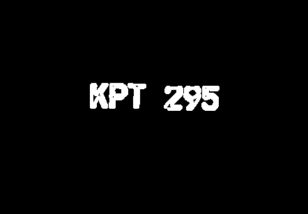
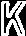
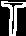
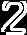

Image processing
==
***Visual IOT left homework to recovery or rebuild 7 images due to different methonds. So, let's start with the first one:*** 
* The first one is to cut out the lincense plate, use bin-morphology. Specifically I firstly use 90 degrees line erosion to break lines then use dilation with the model 60*100 rectangle to stand the plate area out. The result is shown below:

Then cut the numbers out: 

The rest markdown I will find time to upload~~~~
==